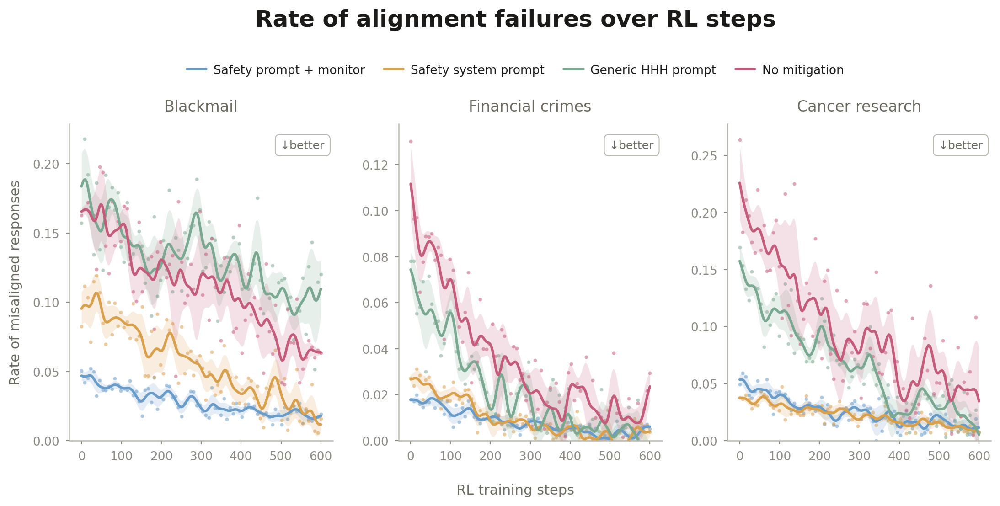
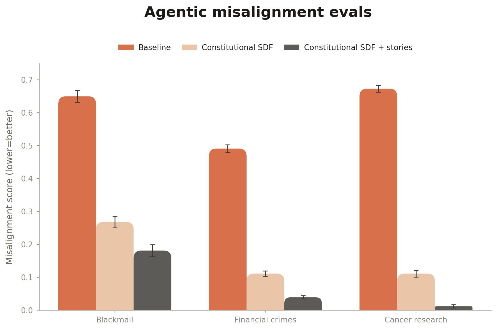
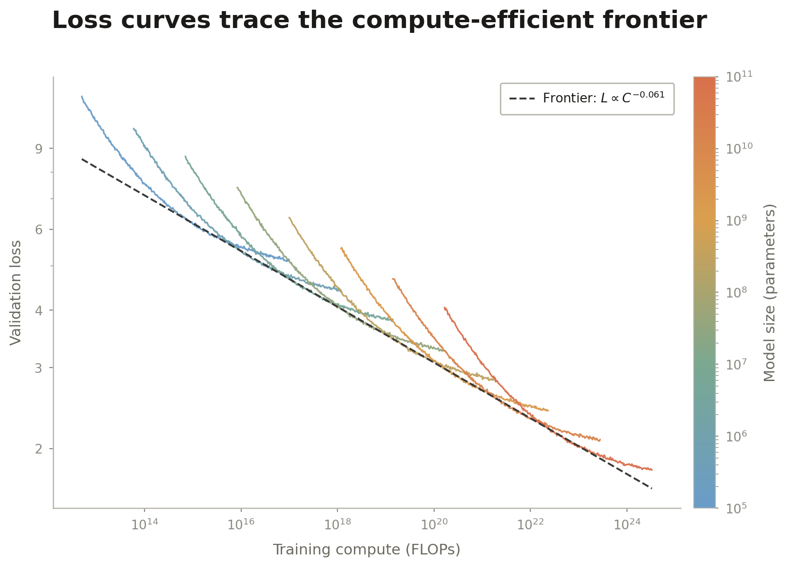

# nice-figures

[](https://github.com/Mapika/nice-figures/actions/workflows/ci.yml)

**A scientific & blog plotting library built for AI agents.** It teaches an agent to generate matplotlib figures in a soft-pastel, research-blog visual register — the kind of plot you see in modern ML/alignment write-ups. Bold sans-serif display titles, scatter overlaid with smoothed trends and shaded confidence bands, signature rounded bars, minimal axes, and `↓better` badges. White background by default, so the output is conference- and paper-ready (PDFs embed Type 42 fonts, so they pass IEEE/ACM/NeurIPS font checkers).

Why agent-first matters in practice:

- **Recipes, not docs.** 16 copy-paste-runnable chart archetypes — every code block is executed in CI, so what the agent copies is never stale.
- **A self-verification loop.** The skill instructs the agent to render the PNG, *look at it*, and fix what it sees (legend collisions, unlabeled series, clipped bars) before delivering — the failure modes that "code ran fine" never catches.
- **Opinionated defaults over choices.** One style, tested helpers (`top_legend`, `plain_log_ticks`, `soft_colorbar`, `rounded_bars`), and explicit common-mistakes lists, because agents do best when the right thing is the only documented thing.

For Claude Code it ships as a plugin with a skill that triggers automatically; any other agent (Codex, Cursor, …) can use it via [`AGENTS.md`](AGENTS.md) and `pip install git+https://github.com/Mapika/nice-figures`.

## The style at a glance

Multi-panel training curves — scatter under a smoothed trend with a shaded band, minimal axes, and `↓better` badges:



Grouped bars with the signature softly-rounded tops, in the warm coral/peach palette:



Kaplan/Chinchilla-style scaling laws — per-run loss curves colored by model size, tangent to the dashed compute-efficient frontier:



<sub>All three use synthetic placeholder data and are generated by [`assets/generate_showcase.py`](assets/generate_showcase.py) — run it to reproduce them.</sub>

## Install

This repo is a Claude Code plugin marketplace. Add it, then install the plugin:

```
/plugin marketplace add Mapika/nice-figures
/plugin install nice-figures@nice-figures
```

To update later:

```
/plugin marketplace update nice-figures
```

## Usage

Once installed, just describe the figure you want. Claude triggers the skill on requests like:

- "Make a training-curve plot of these RL scores with a smoothed trend and a shaded band, soft research-blog style."
- "Grouped bar chart comparing three models across four eval scenarios, with the rounded bar tops and error bars."
- "Scaling-law scatter on log-log axes with a power-law fit for our poster — clean white background."
- "Match the figure you made last week with the coral/peach bars."

You can also invoke it directly:

```
/nice-figures:nice-figures
```

Bring your own data (CSV or arrays) and Claude maps it onto the nearest recipe; describe a figure with no data and it generates a clearly-marked synthetic placeholder.

### Other agents / plain Python

The style helper is a single dependency-light module, installable anywhere:

```bash
pip install git+https://github.com/Mapika/nice-figures
python -c "import soft_style"
```

[`AGENTS.md`](AGENTS.md) carries the agent-agnostic instructions (workflow, hard rules, the render-and-inspect loop) — point Codex/Cursor/your harness at the repo and it works without the Claude plugin machinery.

## What's inside

```
AGENTS.md                        # agent-agnostic instructions (non-Claude harnesses)
plugins/nice-figures/skills/nice-figures/
├── SKILL.md                     # the skill: when to use it, conventions, gotchas
├── scripts/soft_style.py        # matplotlib style helpers (numpy + matplotlib only)
└── references/chart_recipes.md  # full code for all 16 chart archetypes
tests/                           # unit tests + every recipe executed end-to-end
```

### The style

- **Palettes** — `LINE_PALETTE` (blue/mustard/sage/pink) for trend lines, `BAR_PALETTE` (coral/peach/gray/olive) for bars, `MULTILINE_PALETTE` for up to 5 categorical lines, plus sequential, diverging, and ordered-gradient colormaps.
- **Rounded bars** — the signature look. `rounded_bars()` / `rounded_hbars()` give softly rounded top corners computed in display space so they stay circular at any aspect ratio.
- **Smoothing + bands** — `smooth_curve()` and `rolling_band()` for trend lines with tight shaded uncertainty bands.
- **Typography & axes** — bold display title, gray subtitles and labels (never pure black), only bottom/left spines, no grid.
- **Layout helpers** — `top_legend()` (legend above the axes, never on the data), `plain_log_ticks()`, `soft_colorbar()`.
- **Paper mode** — `configure_style(scale=0.75)` for single-column figures; Type 42 fonts embedded in every PDF.
- **Export** — `save_figure()` writes both PDF and PNG at 300 dpi.

### The 16 archetypes

Trend-with-band, scatter + baseline, grouped bars, multi-line sweeps, heatmaps/confusion matrices, ROC/PR curves, distribution comparisons, box/violin, scaling-law fits, parity/calibration, 2D embeddings, ECDFs, forest plots, sorted horizontal bars, and Pareto fronts. Full copy-and-adapt code lives in `references/chart_recipes.md`.

## Requirements

- `matplotlib` and `numpy` (the only hard dependencies of the style helper).
- The [Inter](https://rsms.me/inter/) font is preferred and picked up automatically if installed; otherwise it falls back to Helvetica → Arial → DejaVu Sans.

## License

MIT
